# 🌐 Red Conceptual Interactiva: Salud, ITS y Educación Sexual

Bienvenido a la red conceptual interactiva y profunda basada en la investigación de **María Eugenia Ramírez Ibarra (UACM)** sobre las prácticas de educación sexual en el **Centro de Salud T-III Dr. Maximiliano Ruíz Castañeda** (Iztapalapa, CDMX).

---

## 📱 ¿Cómo experimentar la interactividad en Obsidian para Android?

Tienes **3 formas complementarias** de navegar e interactuar con esta red de 34 nodos y cientos de interconexiones:

### Opción 1: Vista de Grafo Nativa de Obsidian (Physics Graph View) ⭐ *Recomendada*
Obsidian incluye un motor de física interactiva 2D:
1. En Obsidian en tu Android, pulsa el botón de menú (o desliza el panel lateral).
2. Toca el **ícono de grafo** (red de bolitas conectadas) o abre la paleta de comandos y elige **"Open Graph View"** (*Abrir vista de grafo*).
3. Verás una **constelación interactiva completa**: puedes arrastrar las burbujas, pellizcar con dos dedos para hacer zoom, activar filtros por etiquetas (`#salud`, `#its`, `#medicina`, `#ciencia`, `#social`) y al tocar cualquier nodo se abrirá su ficha conceptual completa con sus citas bibliográficas y datos empíricos.

### Opción 2: Lienzo Interactivo (.canvas)
En la carpeta raíz se ha generado el archivo:
📄 **`[[Red_Conceptual_Interactiva.canvas]]`**
- Es el lienzo infinito nativo de Obsidian.
- Agrupa los 34 conceptos en 5 columnas de colores temáticos con tarjetas legibles y flechas de conexión que puedes reorganizar a tu gusto con los dedos.

### Opción 3: Aplicación Web Interactiva Offline
En la carpeta raíz se ha generado:
🌐 **`[[Grafo_Interactivo_Salud_ITS.html]]`**
- Un archivo HTML auto-contenido optimizado para móviles (pantalla táctil).
- Lo puedes abrir directamente en Google Chrome o Firefox en tu celular Android.
- Incluye: física de resortes, barra de búsqueda en tiempo real, filtros por categoría y un panel deslizable inferior (*drawer*) con resúmenes, citas textuales de la tesis y botones para saltar entre nodos conectados.

---

## 🗺️ Mapa General Mermaid (Graph TD Completo con Wikilinks)

Todos los nodos del diagrama están enlazados mediante sintaxis `[[Nombre de la Nota]]` para integrarse con la bóveda de Obsidian:

```mermaid
graph TD
    classDef saludClass fill:#1b4332,stroke:#40916c,stroke-width:2px,color:#d8f3dc;
    classDef itsClass fill:#641220,stroke:#a71e34,stroke-width:2px,color:#ffccd5;
    classDef medClass fill:#0d3b66,stroke:#0077b6,stroke-width:2px,color:#caf0f8;
    classDef cienciaClass fill:#3c096c,stroke:#7b2cbf,stroke-width:2px,color:#e0aaff;
    classDef socialClass fill:#7f4f24,stroke:#a68a56,stroke-width:2px,color:#ede0d4;

    %% -------------------------------------------------------------
    %% NÚCLEO DE LA SALUD
    %% -------------------------------------------------------------
    subgraph S1 ["1. NÚCLEO DE LA SALUD Y PROMOCIÓN"]
        N_SALUD["[[Definicion de Salud (Chapela)]]<br>Capacidad corporeizada de inventar futuros"]:::saludClass
        N_OTTAWA["[[Carta de Ottawa (1986)]]<br>Prerrequisitos estructurales y empoderamiento"]:::saludClass
        N_PS_EMAN["[[Promocion de la Salud Emancipatoria]]<br>Sujetos éticos y diálogo liberador"]:::saludClass
        N_PS_INST["[[Promocion de la Salud Institucional]]<br>Burocracia de control y prescripción"]:::saludClass
        N_ESTILOS["[[Enfoque de Estilos de Vida]]<br>Culpabilización individual y consumo"]:::saludClass
        N_SUJETO["[[Sujeto Etico y Capacidad Deliberativa]]<br>El adolescente como agente activo"]:::saludClass
        N_PROY["[[Proyecto de Vida y Autonomia Corporal]]<br>Soberanía sobre el propio cuerpo"]:::saludClass
    end

    %% -------------------------------------------------------------
    %% EL PROBLEMA DE LAS ITS
    %% -------------------------------------------------------------
    subgraph S2 ["2. EL PROBLEMA DE LAS ITS Y VULNERABILIDAD"]
        N_ITS["[[Infecciones de Transmision Sexual (ITS)]]<br>7 millones de casos anuales en México"]:::itsClass
        N_VPH["[[Virus del Papiloma Humano (VPH)]]<br>Riesgo de cáncer cérvico-uterino"]:::itsClass
        N_VIH["[[VIH y SIDA en Jovenes]]<br>Vía sexual no protegida y estigma"]:::itsClass
        N_BACT["[[ITS Bacterianas (Sifilis y Gonorrea)]]<br>Esterilidad y enfermedad pélvica"]:::itsClass
        N_VULN["[[Vulnerabilidad Biopsicosocial Adolescente]]<br>Inmadurez tisular y desamparo social"]:::itsClass
        N_CONDON["[[Mitos y Resistencia al Uso del Condon]]<br>Resta de placer y desconfianza"]:::itsClass
        N_ESTIGMA["[[Estigma Social, Culpa y Pena]]<br>Miedo a ser tildado de promiscuo"]:::itsClass
        N_AISLA["[[Aislamiento y Retraso en la Atencion]]<br>73% de jóvenes callan sus dudas"]:::itsClass
    end

    %% -------------------------------------------------------------
    %% ENTORNO MÉDICO HEGEMÓNICO
    %% -------------------------------------------------------------
    subgraph S3 ["3. ENTORNO DE LA MEDICINA (MMH)"]
        N_MMH["[[Modelo Medico Hegemonico (Menendez)]]<br>Biologicismo, asistencialismo y control"]:::medClass
        N_VERT["[[Relacion Medico-Paciente Vertical]]<br>Paternalismo y regaños al adolescente"]:::medClass
        N_BAR_INST["[[Barreras Institucionales Centro de Salud T-III]]<br>Largas esperas y falta de privacidad"]:::medClass
        N_TUTOR["[[Exigencia Arbitraria de Tutor Adulto]]<br>Condicionamiento que expulsa a jóvenes"]:::medClass
        N_NOM["[[Violacion de la NOM-005-SSA2-1993]]<br>Vulneración del derecho a la consejería"]:::medClass
        N_FOLLETOS["[[Condoneria y Reparto Mecanico de Folletos]]<br>23% nunca lee los trípticos"]:::medClass
        N_DESPACHO["[[Burocracia de Despacho y Contabilidad]]<br>Prioridad de cuotas sobre la escucha"]:::medClass
    end

    %% -------------------------------------------------------------
    %% ENTORNO DE LA CIENCIA
    %% -------------------------------------------------------------
    subgraph S4 ["4. ENTORNO DE LA CIENCIA Y PARADIGMAS"]
        N_PARAD["[[Tension de Paradigmas Cientificos]]<br>Cálculo tayloriano vs Complejidad (Morin)"]:::cienciaClass
        N_POSIT["[[Paradigma Positivista Biomedico]]<br>Reducción a datos y nosología médica"]:::cienciaClass
        N_CUALIT["[[Paradigma Cualitativo Socio-Critico]]<br>Nombrar palabras y mirar conductas"]:::cienciaClass
        N_ANTROP["[[Aporte de la Antropologia y Sociologia]]<br>Sexualidad como negociación de poder (Weeks)"]:::cienciaClass
        N_PSICO["[[Psicologia Evolutiva y Duelo de la Infancia]]<br>Aberastury y Peter Blos (individuación)"]:::cienciaClass
        N_METOD["[[Metodologia Mixta y Grupo de Reflexion]]<br>60 encuestas y talleres dialógicos"]:::cienciaClass
    end

    %% -------------------------------------------------------------
    %% ENTORNO SOCIAL Y TERRITORIAL
    %% -------------------------------------------------------------
    subgraph S5 ["5. ENTORNO SOCIAL, TERRITORIAL Y POLÍTICO"]
        N_CONST["[[Adolescencia como Construccion Social]]<br>Condición sociohistórica disputada"]:::socialClass
        N_IZTAP["[[Territorio y Marginacion en Iztapalapa]]<br>71% de dependencia económica y hacinamiento"]:::socialClass
        N_GENERO["[[Desigualdad de Genero y Poder Sexual]]<br>Dificultad femenina para negociar condón"]:::socialClass
        N_TABU["[[Tabues Familiares y Silencio Domestico]]<br>Pudor parental y reproducción de mitos"]:::socialClass
        N_DERECHOS["[[Derechos Sexuales y Reproductivos]]<br>Placer, autonomía y laicidad"]:::socialClass
        N_ESI["[[Educacion Sexual Integral Emancipatoria]]<br>Talleres colectivos y justicia sanitaria"]:::socialClass
    end

    %% -------------------------------------------------------------
    %% INTERACCIONES Y VÍNCULOS SISTÉMICOS
    %% -------------------------------------------------------------
    N_SALUD --> N_PS_EMAN
    N_OTTAWA --> N_PS_INST
    N_OTTAWA --> N_PS_EMAN
    N_PS_INST --> N_ESTILOS
    N_PS_EMAN --> N_SUJETO
    N_SUJETO --> N_PROY
    N_PROY --> N_DERECHOS

    N_MMH --> N_VERT
    N_MMH --> N_FOLLETOS
    N_MMH --> N_DESPACHO
    N_VERT --> N_TUTOR
    N_TUTOR --> N_NOM
    N_BAR_INST --> N_AISLA

    N_ITS --> N_VPH
    N_ITS --> N_VIH
    N_ITS --> N_BACT
    N_ITS --> N_VULN
    N_CONDON --> N_ITS
    N_ESTIGMA --> N_AISLA
    N_AISLA --> N_ITS

    N_VERT -->|"Regaño y juicio moral"| N_ESTIGMA
    N_FOLLETOS -.->|"Falta de pedagogía dialógica"| N_CONDON
    N_NOM -->|"Desprotección legal"| N_VULN

    N_IZTAP --> N_VULN
    N_CONST --> N_GENERO
    N_GENERO -->|"Chantaje e inequidad"| N_CONDON
    N_TABU --> N_ESTIGMA

    N_PARAD --> N_POSIT
    N_PARAD --> N_CUALIT
    N_POSIT --> N_MMH
    N_CUALIT --> N_METOD
    N_ANTROP --> N_CONST
    N_PSICO --> N_VULN

    N_ESI ==>|"Transformación emancipada"| N_DERECHOS
    N_DERECHOS ==>|"Autonomía y prevención comunitaria"| N_ITS
```

---

## 📂 Directorio de las 34 Notas Conceptuales Atómicas

Todas las notas se encuentran en la carpeta `Red_Conceptual_Salud_ITS/`:

| Eje Temático | Notas Conceptuales con Citas y Datos Empíricos |
| :--- | :--- |
| **1. Núcleo de la Salud** | [[01_Definicion_de_Salud_Chapela]], [[02_Carta_de_Ottawa_1986]], [[03_Promocion_de_la_Salud_Emancipatoria]], [[04_Promocion_de_la_Salud_Institucional]], [[05_Enfoque_de_Estilos_de_Vida]], [[06_Sujeto_Etico_y_Capacidad_Deliberativa]], [[07_Proyecto_de_Vida_y_Autonomia_Corporal]] |
| **2. Problema de las ITS** | [[08_Infecciones_de_Transmision_Sexual_ITS]], [[09_Virus_del_Papiloma_Humano_VPH]], [[10_VIH_y_SIDA_en_Jovenes]], [[11_ITS_Bacterianas_Sifilis_y_Gonorrea]], [[12_Vulnerabilidad_Biopsicosocial_Adolescente]], [[13_Mitos_y_Resistencia_al_Uso_del_Condon]], [[14_Estigma_Social_Culpa_y_Pena]], [[15_Aislamiento_y_Retraso_en_la_Atencion]] |
| **3. Entorno de la Medicina** | [[16_Modelo_Medico_Hegemonico_Menendez]], [[17_Relacion_Medico_Paciente_Vertical]], [[18_Barreras_Institucionales_Centro_de_Salud_T3]], [[19_Exigencia_Arbitraria_de_Tutor_Adulto]], [[20_Violacion_de_la_NOM_005_SSA2_1993]], [[21_Condoneria_y_Reparto_Mecanico_de_Folletos]], [[22_Burocracia_de_Despacho_y_Contabilidad_de_Pacientes]] |
| **4. Entorno de la Ciencia** | [[23_Tension_de_Paradigmas_Cientificos]], [[24_Paradigma_Positivista_Biomedico]], [[25_Paradigma_Cualitativo_Socio_Critico]], [[26_Aporte_de_la_Antropologia_y_Sociologia]], [[27_Psicologia_Evolutiva_y_Duelo_de_la_Infancia]], [[28_Metodologia_Mixta_y_Grupo_de_Reflexion]] |
| **5. Entorno Social & Territorial** | [[29_Adolescencia_como_Construccion_Social]], [[30_Territorio_y_Marginacion_en_Iztapalapa]], [[31_Desigualdad_de_Genero_y_Poder_Sexual]], [[32_Tabues_Familiares_y_Silencio_Domestico]], [[33_Derechos_Sexuales_y_Reproductivos]], [[34_Educacion_Sexual_Integral_Emancipatoria]] |

---

> [!TIP]
> Al navegar en Android, puedes mantener presionado un enlace `[[...]]` para abrir una previsualización flotante sin salir de la nota principal.
