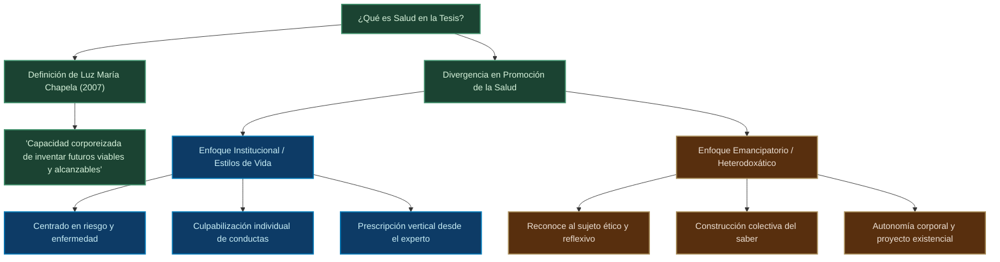
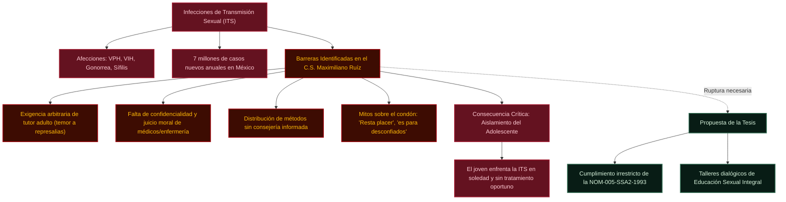
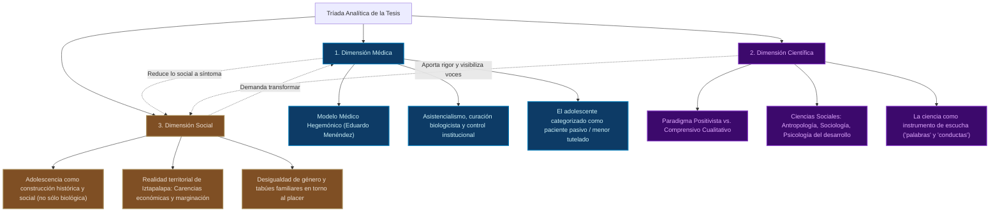

# Grafo Conceptual: Educación Sexual, Salud e ITS en la Adolescencia

> Basado en la investigación de **María Eugenia Ramírez Ibarra (UACM)**:
> *"La Educación Sexual otorgada a los y las Adolescentes de 15 a 19 años en el Centro de Salud T-III Dr. Maximiliano Ruíz Castañeda. Una reflexión de las prácticas de promoción de la salud."*

---

## 1. Grafo General del Sistema (Graph TD)

Este diagrama está optimizado en orientación vertical (**TD: Top-Down**) para facilitar la navegación y el zoom táctil en la aplicación **Obsidian para Android**.

```mermaid
graph TD
    %% ESTILOS VISUALES Y PALETA DE COLORES
    classDef saludClass fill:#1b4332,stroke:#40916c,stroke-width:2px,color:#d8f3dc;
    classDef itsClass fill:#641220,stroke:#a71e34,stroke-width:2px,color:#ffccd5;
    classDef medClass fill:#0d3b66,stroke:#0077b6,stroke-width:2px,color:#caf0f8;
    classDef cienciaClass fill:#3c096c,stroke:#7b2cbf,stroke-width:2px,color:#e0aaff;
    classDef socialClass fill:#7f4f24,stroke:#a68a56,stroke-width:2px,color:#ede0d4;

    %% -------------------------------------------------------------
    %% SUBGRAFO 1: NÚCLEO DE LA SALUD Y PROMOCIÓN DE LA SALUD
    %% -------------------------------------------------------------
    subgraph NUCLEO_SALUD ["1. NÚCLEO DE LA SALUD Y PROMOCIÓN"]
        SALUD_DEF["Salud: Capacidad corporeizada<br>de inventar futuros viables (Chapela)"]:::saludClass
        OTTAWA["Carta de Ottawa (1986):<br>Prerrequisitos y empoderamiento"]:::saludClass
        PS_INST["Promoción Institucional:<br>Focalizada en riesgo y prescripción"]:::saludClass
        PS_EMAN["Promoción Emancipatoria:<br>Sujetos éticos y autónomos"]:::saludClass
        HABILIDADES["Desarrollo de Capacidades Humanas<br>y Proyecto de Vida"]:::saludClass
    end

    %% -------------------------------------------------------------
    %% SUBGRAFO 2: EL PROBLEMA DE LAS ITS
    %% -------------------------------------------------------------
    subgraph PROBLEMA_ITS ["2. EL PROBLEMA DE LAS ITS"]
        ITS_PANORAMA["Epidemia y Morbilidad de ITS:<br>VPH, VIH/SIDA, Gonorrea, Sífilis"]:::itsClass
        ITS_CONDON["Barreras en el Uso del Condón:<br>Mitos, vergüenza y desabasto"]:::itsClass
        ITS_ESTIGMA["Estigma y Culpa Social:<br>Asociación de ITS con promiscuidad"]:::itsClass
        ITS_SILENCIO["Falta de Detección Oportuna:<br>Miedo a acudir a los servicios"]:::itsClass
        VULNERABILIDAD["Vulnerabilidad Biopsicosocial:<br>Infección temprana y asimetría de poder"]:::itsClass
    end

    %% -------------------------------------------------------------
    %% SUBGRAFO 3: ENTORNO MÉDICO (MODELO HEGEMÓNICO)
    %% -------------------------------------------------------------
    subgraph ENTORNO_MEDICINA ["3. ENTORNO DE LA MEDICINA"]
        MMH["Modelo Médico Hegemónico (MMH):<br>Biologicista y patologizante"]:::medClass
        REL_VERTICAL["Relación Médico-Paciente Vertical:<br>Adolescente visto como objeto pasivo"]:::medClass
        BARRERA_INST["Barreras Institucionales en C.S.:<br>Exigencia de tutor, falta de privacidad"]:::medClass
        VIOLACION_NOM["Violación a la NOM-005-SSA2-1993:<br>Consejería negada o condicionada"]:::medClass
        REDUCCION_BIO["Reducción Biologicista:<br>Educación limitada a dar folletos"]:::medClass
    end

    %% -------------------------------------------------------------
    %% SUBGRAFO 4: ENTORNO DE LA CIENCIA Y PARADIGMAS
    %% -------------------------------------------------------------
    subgraph ENTORNO_CIENCIA ["4. ENTORNO DE LA CIENCIA"]
        PARADIGMAS["Tensión de Paradigmas Científicos"]:::cienciaClass
        POSITIVISMO["Paradigma Positivista:<br>Datos cuantitativos y epidemiología médica"]:::cienciaClass
        CUALITATIVO["Paradigma Cualitativo Socio-Crítico:<br>Experiencias, palabras y sentires"]:::cienciaClass
        INTERDISCIP["Interdisciplina:<br>Antropología, Sociología y Psicología"]:::cienciaClass
    end

    %% -------------------------------------------------------------
    %% SUBGRAFO 5: ENTORNO SOCIAL, CULTURAL Y POLÍTICO
    %% -------------------------------------------------------------
    subgraph ENTORNO_SOCIAL ["5. ENTORNO SOCIAL Y COMUNITARIO"]
        CONST_SOCIAL["Adolescencia como Construcción Social:<br>Niñez vs Adultez en disputa"]:::socialClass
        CONTEXTO_IZT["Contexto Territorial Iztapalapa:<br>Vulnerabilidad, rezago y marginación"]:::socialClass
        GENERO_PODER["Relaciones de Género y Desigualdad:<br>Dificultad femenina para negociar condón"]:::socialClass
        DERECHOS_SEX["Derechos Sexuales y Reproductivos:<br>Autonomía, placer y decisión informada"]:::socialClass
    end

    %% =============================================================
    %% CONEXIONES E INTERACCIONES CRÍTICAS ENTRE EJES
    %% =============================================================

    %% Núcleo Salud hacia Enfoques
    OTTAWA --> PS_INST
    OTTAWA --> PS_EMAN
    SALUD_DEF --> PS_EMAN
    PS_EMAN --> HABILIDADES
    HABILIDADES --> DERECHOS_SEX

    %% Medicina y su sesgo frente a la Salud
    MMH --> PS_INST
    MMH --> REL_VERTICAL
    MMH --> REDUCCION_BIO
    REL_VERTICAL --> BARRERA_INST
    BARRERA_INST --> VIOLACION_NOM

    %% Impacto del Entorno Médico sobre el Problema de las ITS
    REDUCCION_BIO -.->|"Información incompleta"| ITS_CONDON
    BARRERA_INST -->|"Aleja a los jóvenes"| ITS_SILENCIO
    REL_VERTICAL -->|"Juicios morales"| ITS_ESTIGMA
    VIOLACION_NOM -->|"Falta de consejería"| VULNERABILIDAD

    %% Factores Sociales e ITS
    CONTEXTO_IZT --> VULNERABILIDAD
    CONST_SOCIAL --> GENERO_PODER
    GENERO_PODER -->|"Imposibilidad de acordar condón"| ITS_CONDON
    ITS_ESTIGMA --> ITS_SILENCIO
    ITS_SILENCIO --> ITS_PANORAMA

    %% Ciencia y Metodología
    PARADIGMAS --> POSITIVISMO
    PARADIGMAS --> CUALITATIVO
    POSITIVISMO --> MMH
    CUALITATIVO --> INTERDISCIP
    INTERDISCIP --> CONST_SOCIAL
    CUALITATIVO --> PS_EMAN

    %% Salida Emancipatoria como Solución al problema de las ITS
    PS_EMAN ==>|"Desmitifica y empodera"| DERECHOS_SEX
    DERECHOS_SEX ==>|"Prevención real con agencia"| ITS_PANORAMA
```

---

## 2. Micro-Grafos Focalizados (Lectura Rápida en Móvil)

Para consultar áreas específicas de manera ágil en pantallas pequeñas, se desglosan los 3 ejes centrales:

### Eje A: El Núcleo de la Salud (Modelo Emancipatorio vs. Modelo Institucional)

---

### Eje B: El Problema de las ITS y Barreras en el Centro de Salud

---

### Eje C: La Tríada Medicina - Ciencia - Sociedad

---

## 3. Síntesis Conceptual y Hallazgos de la Tesis

### I. El Núcleo de la Salud
- **Ruptura con el modelo biológico tradicional:** La salud no es sólo ausencia de enfermedad física, sino la **capacidad corporeizada de inventar futuros viables y alcanzables** (Luz María Chapela, 2007).
- **Crítica a la Promoción Institucional:** Suele operar bajo el enfoque de "estilos de vida" de corte neoliberal, responsabilizando y culpabilizando al individuo de sus conductas sin transformar sus condiciones materiales de existencia.
- **La Alternativa Emancipatoria:** Promueve la autoconstrucción, la capacidad deliberativa, el autoconocimiento del cuerpo y la dignidad ética del joven como protagonista de su salud.

### II. El Problema de las ITS
- **Epidemiología oculta y vulnerabilidad:** Las ITS afectan desproporcionadamente a la adolescencia por desinformación, vulnerabilidad biológica de tejidos genitales en desarrollo y dificultades para negociar prácticas seguras.
- **La falacia del folleto:** Repartir trípticos y condones de manera mecánica fracasa porque omite el abordaje de la afectividad, el machismo, la coerción y el miedo al estigma social.
- **Consecuencia observada:** Los adolescentes postergan la atención médica por temor al castigo familiar o al juicio moral del personal de salud, agravando el cuadro infeccioso.

### III. Medicina, Ciencia y Contexto Social
1. **Medicina (Poder Institucional):** El personal médico incurre en violaciones a la norma oficial (**NOM-005-SSA2-1993**), condicionando la atención a la presencia de padres o tutores, lo que desampara a jóvenes en conflicto familiar o en situación de calle.
2. **Ciencia (Metodología Mixta Crítica):** La autora integra datos sociodemográficos con el paradigma cualitativo (entrevistas semiestructuradas y talleres de reflexión), demostrando que la experiencia subjetiva es indispensable para fundamentar la política pública.
3. **Entorno Social (Iztapalapa y Género):** El contexto de marginación urbana agudiza la desprotección. Las mujeres adolescentes enfrentan una doble carga: censura moral sobre su deseo sexual e imposibilidad de exigir el uso de preservativos ante parejas masculinas renuentes.

---

> [!TIP]
> **Consejo para Obsidian en Android:**  
> Puedes interactuar pellizcando con dos dedos sobre los diagramas Mermaid para hacer zoom o pan. Si creas notas individuales para cada nodo (por ejemplo `[[Modelo Médico Hegemónico]]`), Obsidian conectará automáticamente este mapa con tu grafo global de notas.
